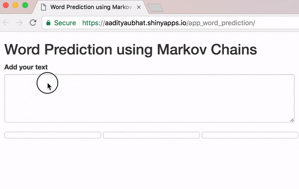

# Word Prediction Using Markov Chains

 
[Shiny App - Word Prediction](https://aadityaubhat.shinyapps.io/app_word_prediction/)

### Methodology 

to-do

### Tools Used

Spark -  Computing n-grams

R - Data Processing, Prediction Algorithm

Shiny - Creating a Web App

[Data Source](https://d396qusza40orc.cloudfront.net/dsscapstone/dataset/Coursera-SwiftKey.zip)

